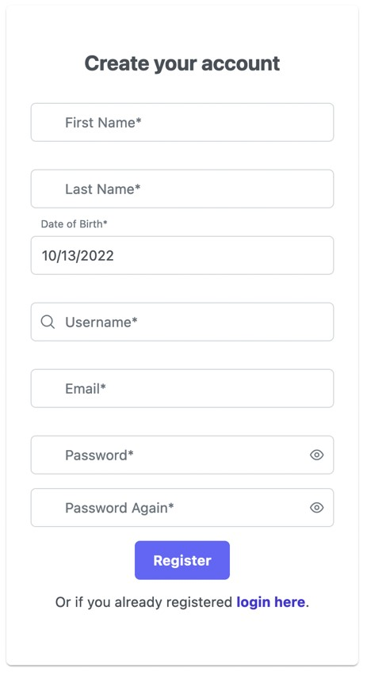
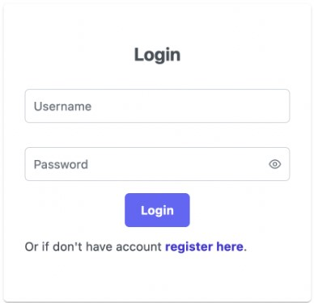

# Social app

>The aim of this app is to provide an easy to use social application.
The user will be able to post pictures and text, post comments.

## Functions:

- User management:

    - User login
    - User registration
    - User deletion
- Ability to create posts:

    - Post pictures
    - Post text
    - Comment under posts
- Edit posts:

    - Delete posts
    - Delete comment
    - Remove picture
-  Editing user:

    - Edit profile picture
    - Edit profile description
    - Edit username
- Post interaction:

    - Liking posts
    - Comment under posts
    - Edit comment

## Milestones:

### 1. Creating user

>The user should be able to register an account with the following information:
- First Name
- Last Name
- Date of Birth
- Username
- Email
- Password

### 2. Login User

- The user will be able to login with username and password given the account is registered.
- Authentication and authorization will be secured by JWT tokens.

### 3. User Actions

- The user should be able to create posts and edit them.
- Editing own posts:
    - Creating new posts.
    - Deleting existing posts.
    - Uploading pictures to existing posts.
    - Upload text posts.
    - Remove comment from posts.
    - Edit comment
  

- Interacting with other users posts:
    - Like an users post.
    - Comment under an users post.
    - Edit comment made under an users post.
    - Remove own comment/like from an users post.

### 4. Account management

- The user should be able to modify personal account details.
    - Change username.
    - Change password.
    - Change first and last name.

## Workload management

### Frontend development

- Frontend will be made by Botond.

### Backend development

- Creating user and Login will be handled by Alex.
- User actions and account management (including post and comment management) will be handled by Ádám.
- Backend progress will be supervised by Botond.

### Scope of the project

>Initially, we would like to make a social app where users can create basic posts with pictures and text. Also users can interact with other users posts, for example: Like, comment.

# TODO progress

- Frontend initial setup :white_check_mark:
- Backend initial setup :white_check_mark:
- Create documentation :white_check_mark:
- Frontend login page :white_check_mark:
- Frontend login logic :white_check_mark:
- Backend login logic :white_check_mark:
- Database scheme :bangbang:
- Backend login logic :white_check_mark:
- Frontend registration page :white_check_mark:
- Frontend registration logic :white_check_mark:
- Backend registration logic :white_check_mark:
- Creatin authorization checks on the frontend (if the user is not authenticated ask to login or register/if not permitted to do warn him/her) :clock130:
- Frontend userpage :arrows_counterclockwise:
- Backend user information endpoint :arrows_counterclockwise:
- Frontend user modification tab :clock130:
- Backend user update endpoint :clock130:
- Backend user delete endpoint :clock130:
- Frontend userpage post creation tab :clock130:
- Frontend post creation modal :clock130:
- Frontend post creation logic :clock130:
- Backend post creation endpoint :clock130:
- Frontend post update page :clock130:
- Frontend post update logic :clock130:
- Backend post update endpoint :clock130:
- Frontend post delete page :clock130:
- Frontend post delete logic :clock130:
- Backend post delete logic :clock130:
- Frontend like post logic :clock130:
- Bakcend like post endpoint :clock130:
- Frontend comment under post :clock130:
- Backend comment endpoint :clock130:
- Frontend modify comment :clock130:
- Backend modify comment :clock130:

## Price

120 Million HUF