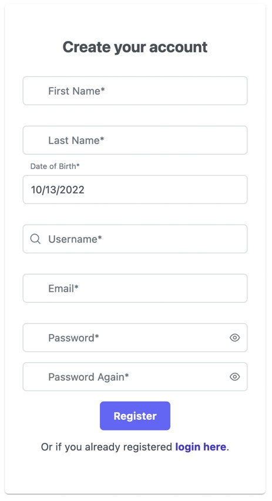

  
# Social app

The aim of this app is to provide an easy to use social application.
The user will be able to post pictures and text, post comments.

## Functions:
- User management:
    - User login
    - User registration
    - User deletion
- Ability to create posts:
    - Post pictures
    - Post text
    - Comment under posts
- Edit posts:
    - Delete posts
    - Delete comment
    - Remove picture
-  Editing user:
    - Edit profile picture
    - Edit profile description
    - Edit username
- Post interaction:
    - Liking posts
    - Comment under posts
    - Edit comment

## Milestones:

### 1. Creating user
The user should be able to register an account with the following information:
- First Name
- Last Name
- Date of Birth
- Username
- Email
- Password

### 2. Login User
- The user will be able to login with username and password given the account is registered.
- Login information will be protected by JWT authorization.

### 3. User Actions
- The user should be able to create posts and edit them.
- Editing own posts:
    - Creating new posts.
    - Deleting existing posts.
    - Uploading pictures to existing posts.
    - Upload text posts.
    - Remove comment from posts.
    - Edit comment
  

- Interacting with other users posts:
    - Like an users post.
    - Comment under an users post.
    - Edit comment made under an users post.
    - Remove own comment/like from an users post.

### 4. Account management
- The user should be able to modify personal account details.
    - Change username.
    - Change password.
    - Change first and last name.

## Workload management

### Frontend development
- Frontend will be handled by Botond.
TODO

### Backend development
- Creating user and Login will be handled by Alex.
- User actions and account management will be handled by Ádám.

### Scope of the project
Initially, we would like to make a social app where users can create basic posts with pictures and text. Also users can interact with other users posts, for example: Like, comment.

## Price
TODO